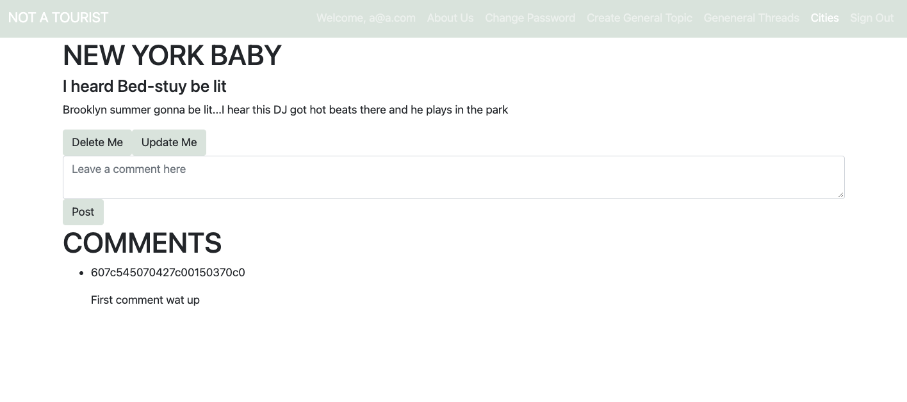
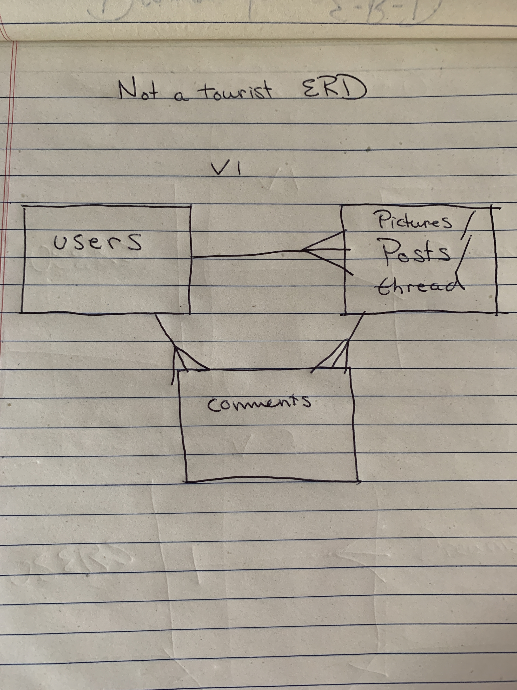
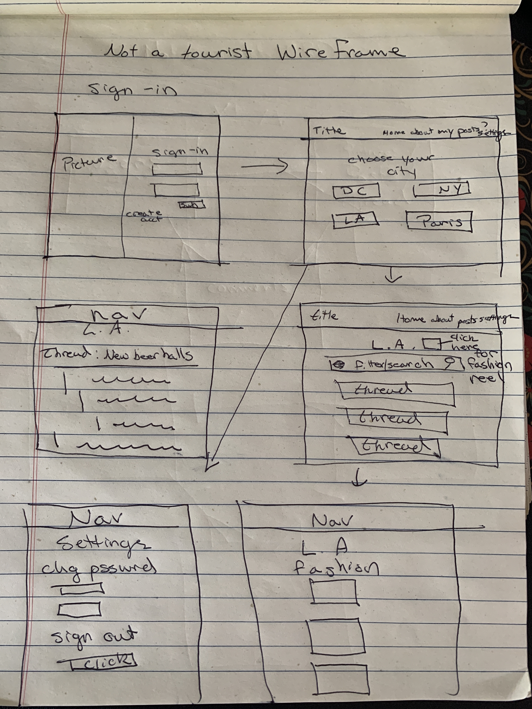

# Not A Tourist

### Important Links
-	Front-End-Repo: https://github.com/wpMcDonnell/not-a-tourist-client

-	Deployed API: https://not-a-tourist-api.herokuapp.com

-	Deployed Client: https://wpmcdonnell.github.io/not-a-tourist-client/

### Not A Tourist
"Not A Tourist" is a site where users can select a city or start threads in the general section in the form of posts. Once created, original creators of posts can update or delete their posts. All users may then comment on available posts. Ideally, users will post lists and information regaring travel to a particular city of choice.

### Planning
First I created a wireframe and users stories to physically conceputalize how I wanted the app and layout to look. I also created a ERD to conceptualize how the app would talk to this API. In building the API, I built a resource "posts"and "users" which user's, aka owners, could CRUD. I built the resource using a mongoose Schema and then using express routes. Eventually I built 4 other "post" resource, each city having their own. Eventually I added a "comments" schema which reference the User and was given a field of postOwner which was feed the params.id of the post a user was currently viewing.

### User Stories
* As a user, I want to be able to sign up, sign in, change my password, and sign-out
* As a user, I want to be able to select a city thread board (GET)
* As a user, I want to be able to start a thread (POST)
* As a user, I want to be able to edit my own threads / POSTS and comments (PATCH)
* As a user, I want other users to be able to comment on my threads
* As a user, I want to be able to comment on other user's threads (POST)
* As a user, I want to be able to delete my threads (DELETE)
* As a user, I want to be able to get all my posts and pictures (GET) (STRETCH)
* As a user, I want to be able to upload and post an image -- fashion picture for city -- (POST) (STRETCH)
* As a user, I want to be able to comment on other people's pictures (POST) (STRETCH)
* As a user, I want to delete my own picture (DELETE) (STRETCH)

### Technologies Used
-	HTML5
-	SCSS
-	React
-	JSX
-	Heroku
-	Express
-	Node.js

###### Users
| Verb   | URI Pattern  |Body    |Headers  |  Status | Body |
|--------|--------------|------  |-----  |-------------------|------------|
| POST   | `/sign-up`   |credentials | empty | 201, Created| user
| POST   | `/sign-in`   |credentials | empty | 200 Ok | user w/token
| PATCH  | `/change-password/`|password |token| 204 No Content| user w/token
| DELETE | `/sign-out/`       | empty|token |   201 Created | empty

###### posts
###### repeat same routes for each city with uri having city abbreviation

| Verb   | URI   |Body    |Headers  |  Status | Body |
|--------|--------------|------  |-----  |-------------------|------------|
| POST   | `/posts`   |{} | token | 201, Created| post Obj
| GET   | `/posts`   |n/a | empty | 200 Ok | post Obj
| GET  | `/posts/:id`|n/a |token| 200 Ok| post Obj
| DELETE | `/posts/:id` |n/a |token | 200 Ok | n/a
| PATCH | `/posts/:id` |Picture data | token | 200, Ok | post Obj

###### comments

| Verb   | URI   |Body    |Headers  |  Status | Body |
|--------|--------------|------  |-----  |-------------------|------------|
| POST   | `/comments`   |{} | token | 201, Created| comment Obj
| GET   | `/comments`   |n/a | empty | 200 Ok | comment Obj
| GET  | `/comments/:id`|n/a |token| 200 Ok| comment Obj

### Unsolved Problems
* I would like to add more styling

#### Screen Shot

#### ERD

#### Wireframe

